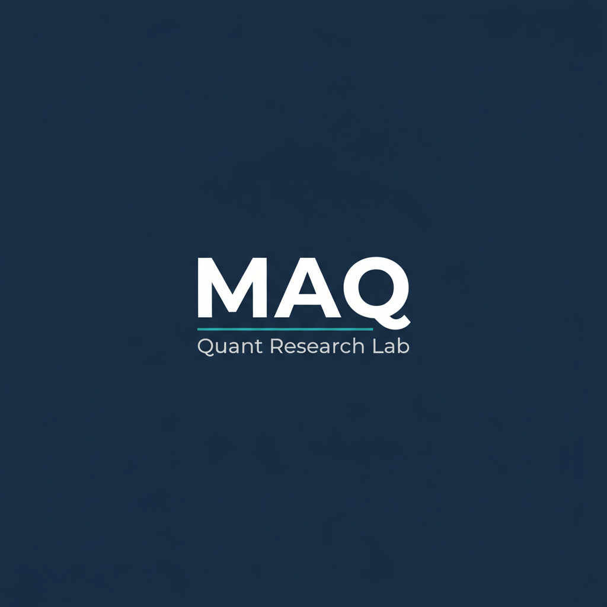

# Multi-Agent Quant Lab

**AI 에이전트로 굴러가는 알고리즘 트레이딩 시스템을 만든다**

*Claude · Codex 같은 AI 에이전트와 함께,
주식 · 크립토 시장에서 실제로 작동하는 트레이딩 시스템을 짜는 오픈 스터디*

---

## 🎯 Mission

**Multi-Agent Quant Lab (MAQ Lab)** 은
**AI 코딩 에이전트(Claude, Codex 등)** 를 적극적으로 활용해
**실제 시장(주식 · 크립토)에서 작동하는 알고리즘 트레이딩 시스템**을
처음부터 끝까지 만들어보는 스터디입니다.

논문을 쓰기 위한 연구도, 발표를 위한 백테스트도 아닙니다.
목표는 단 하나:

> **"실거래에 투입할 수 있는 시스템을 만든다."**

이를 위해 AI 에이전트는 우리의 **동료 개발자이자 리서처**로 일합니다.
사람은 가설과 판단을 맡고, 에이전트는 코드 · 데이터 · 검증을 빠르게 돌립니다.

---

## 🧭 What We Build

| 레이어 | 내용 |
|---|---|
| 🛰️ **Data Layer** | 시세 / 호가 / 온체인 / 매크로 데이터 수집 & PIT 정합성 관리 |
| 🧪 **Research Layer** | 가설 생성 → 시그널 정의 → 통계 검증 |
| ⚙️ **Strategy Layer** | 전략 코드화, 파라미터 튜닝, 리스크 모듈 |
| 📊 **Backtest Layer** | 재현 가능한 백테스트, 슬리피지 / 수수료 / 체결 시뮬레이션 |
| 🚀 **Execution Layer** | 페이퍼 트레이딩 → 라이브 트레이딩 (거래소 API 연동) |
| 🛡️ **Ops Layer** | 모니터링, 알림, 사고 대응, 포지션 관리 |

각 레이어는 사람과 AI 에이전트가 **짝을 이뤄** 만듭니다.

---

## 🤖 Why "Multi-Agent"?

이 스터디 이름의 *Multi-Agent* 는 두 가지를 의미합니다.

1. **개발 측면 — AI 코딩 에이전트와 협업**
   Claude Code, Codex, Gemini 등을 활용해
   리서치 → 코드 → 백테스트 사이클을 압축합니다.
   사람은 전략과 의사결정에 집중합니다.

2. **시스템 측면 — 역할 분담형 트레이딩 에이전트**
   하나의 거대 모델이 아니라,
   *데이터 수집 · 시그널 생성 · 리스크 관리 · 실행* 을 담당하는
   여러 에이전트가 협력하는 구조를 지향합니다.

> 사람도 에이전트, AI도 에이전트.
> *함께 굴리는 트레이딩 데스크* 를 만드는 게 우리의 그림입니다.

---

## 🔬 Research Tracks

알고리즘 트레이딩 시스템을 만들기 위해
지금 진행 중인 사전 리서치 트랙들입니다.

- 📈 **Macro → Market Mapping** *(현재 진행 중)*
  거시 지표(물가 · 금리 · 유동성)와 자산 가격의 연결 구조 분석.
  본격적인 전략 개발 전에 시장의 큰 흐름을 잡기 위한 준비 단계입니다.

- 🧮 **Signal Engineering**
  단순 지표가 아니라 *실제 트레이딩 가능한* 신호로 가공.
  레벨 / 변화율 / 서프라이즈 / 레짐 의존성까지 포함.

- 🧱 **Backtest Infrastructure**
  Point-in-Time, 슬리피지, 체결 모델까지 갖춘
  *거짓말하지 않는* 백테스트 환경 구축.

- 🛡️ **Risk & Execution**
  포지션 사이징, 손절, 상관관계 헤지, 라이브 환경 전환.

> 매크로 리서치는 **메인이 아니라 디딤돌** 입니다.
> 진짜 목적지는 **라이브 트레이딩 시스템** 입니다.

---

## 📂 Projects

> 아직 공개된 프로젝트는 없습니다.
> 사전 리서치 단계가 마무리되는 대로 하나씩 오픈할 예정입니다.

대략적인 로드맵:

- 🧪 **거시 지표 → 자산 반응 리서치** *(진행 중, 비공개)*
- 🧮 **시그널 R&D 라이브러리**
- 🧱 **Point-in-Time 정합 백테스트 엔진**
- 🚀 **거래소 API 연동 실행 모듈**

---

## 🛠️ Tech & Tools

- **AI Agents** — Claude Code, Codex, Gemini
- **Languages** — Python · Rust · JavaScript · TypeScript
- **Data** — DuckDB, Polars, Parquet
- **Backtest** — 자체 엔진 (+ vectorbt / backtrader 등 참고)
- **Markets & Venues**
  - 🇰🇷 **국내 주식** — 한국거래소 (KRX)
  - 🇰🇷 **국내 코인** — 업비트, 빗썸 등
  - 🌏 **해외 코인** — 바이낸스, 바이비트 등
- **Infra** — Docker, GitHub Actions, 셀프호스팅

---

## 🤝 Who Should Join

거창한 자격은 필요 없습니다. 다음 중 하나라도 해당되면 환영합니다.

- 💡 **시장에 대한 가설은 있는데** 검증할 환경이 없는 분
- 🛠️ **개발은 익숙한데** 금융/시장 맥락이 부족한 분
- 📈 **트레이딩 경험은 있는데** 시스템화가 어색한 분
- 🤖 **AI 에이전트로 뭔가 만들어보고 싶은** 분

→ 사람마다 잘하는 게 다르기 때문에, 어디서든 어울리는 자리가 있습니다.

---

## 📌 Philosophy

> 멋있어 보이는 모델보다 — **재현 가능한 결과**  
> 예쁜 백테스트보다 — **Point-in-Time 정합성**  
> 한 번 잘 맞은 신호보다 — **레짐을 넘는 강건성**  
> 빠른 프로토타입보다 — **실거래에 투입할 수 있는 안정성**  

그리고 무엇보다,

> **"AI에게 시켜서 만든 시스템이 진짜로 시장에서 살아남는가?"**
> 이 질문에 답하는 것이 우리 스터디의 존재 이유입니다.

---

## 📫 Contact

- 🐙 **GitHub Issues / Discussions** — 공개적인 논의는 여기로
- 💬 **KakaoTalk** — [open.kakao.com/me/minsuksung](https://open.kakao.com/me/minsuksung)
- ✈️ **Telegram** — [t.me/minsuksung](https://t.me/minsuksung)
- 📚 각 레포의 `README.md` 에서 더 자세한 컨텍스트 확인 가능

— *Humans set the thesis. Agents do the reps. Markets do the judging.* —

